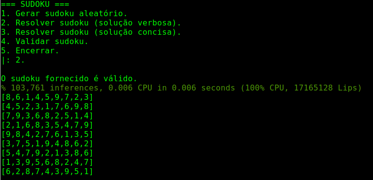
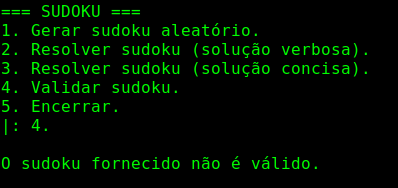

# Sudoku

**Disciplina**: FGA0210 - PARADIGMAS DE PROGRAMAÇÃO - T01 <br>
**Nro do Grupo**: 03<br>
**Paradigma**: Lógico<br>

## Alunos
|Matrícula | Aluno |
| -- | -- |
| 17/0013651  |  João Gabriel Antunes |
| 17/0163571  |  Murilo Loiola Dantas |

## Sobre 
O projeto resolve um problema combinacional famoso, que foi até transformado em jogo, o Sudoku, com o tabuleiro padrão de 9x9. Ele pode gerar tabuleiros válidos a partir de uma tabela em branco, encontrar soluções para tabelas parcialmente preenchidas e verificar a validade de tabelas completas.

## Screenshots
Adicione 2 ou mais screenshots do projeto em termos de interface e/ou funcionamento.

## Instalação 
**Linguagens**: Prolog<br>
**Tecnologias**: SWI-Prolog<br>
Para rodar o projeto é preciso estar com o ```swi-prolog``` instalado em sua máquina.

Para instalar o necessário, caso o seu sistema operacional for alguma distribuição do Linux, siga os passos presentes na documentação do [SWI-Prolog](https://www.swi-prolog.org/build/unix.html).

Caso o seu sistema operacional seja macOS, verifique se o distribuidor de pacotes HomeBrew está instalado. Caso não, siga os passos na documentação do [HomeBrew](https://docs.brew.sh/Installation). A seguir, digite em seu terminal:
```bash
brew install swi-prolog
```

Com o ```swi-prolog``` instalado, já é possível rodar o projeto.

## Uso 
Para rodar o programa com o menu interativo, entre na pasta raíz do projeto e rode o comando:

```bash
swipl -g 'main.' main.pl
```

O menu será apresentado ao usuário com as opções de:
- Gerar uma tabela sudoku aleatória.
- Resolver uma tabela parcialmente preenchida utilizando a solução verbosa.
- Resolver uma tabela parcialmente preenchida utilizando a solução concisa.
- Verificar a validade de uma tabela sudoku (completa ou não).
- Encerrar o programa.

Para selecionar uma opção, basta digitar o número correspondente seguido de um ponto final e pressionar a tecla Enter.

As opções de resolver uma tabela parcialmente preenchida apresentarão a tabela resolvida (caso possível) e também o tempo utilizado para o cálculo. Caso a tabela seja inválida (não possui solução), o programa informará ao usuário e retornará ao menu.

Exemplo de saída ao requisitar a solução verbosa.


Exemplo de saída ao validar um sudoku com números repetidos em uma linha.


### **Importante**

A tabela utilizada nas opções de resolução e validação está presente no arquivo ```sudoku.txt```. O usuário pode alterar a tabela à vontade e testar diferentes respostas. Certifique-se de manter a formatação da tabela inalterada.

No arquivo ```examples.txt``` há outras tabelas parcialmente completas e válidas. Basta substituir a tabela presente em ```sudoku.txt``` por alguma delas, caso o usuário queira testar diferentes respostas de maneira rápida.

## Vídeo
Adicione 1 ou mais vídeos com a execução do projeto.

## Outros 
Devido a forma como o menu é implementado, não é possível utilizar a função de *backtracking* presente no Prolog. No entanto, caso o usuário deseje, basta testar cada predicado individualmente. Para isso, carregue o arquivo main.pl utilizando o comando:

```bash
swipl main.pl
```

Em sequência, basta testar o predicado desejado:
- ```generate.``` para gerar um sudoku aleatório.
- ```solve_short.``` para solucionar o sudoku presente no arquivo utilizando a solução concisa.
- ```solve_extensive.``` para solucionar o sudoku presente no arquivo utilizando a solução verbosa.

Após testar um predicado, basta pressionar a tecla ```;``` continuamente para receber outras soluções, enquanto possível.

## Fontes
Caso utilize materiais de terceiros, referencie-os adequadamente.
